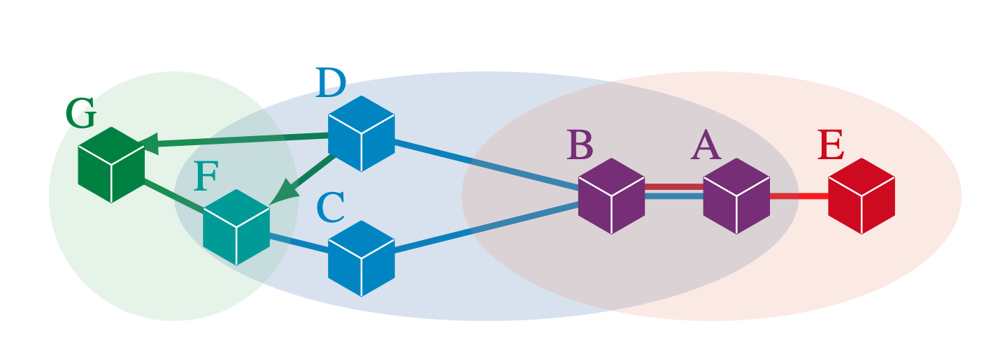

# 💬 GossipSub FM Model Repository



GossipSub is a new peer-to-peer communication protocol designed to
counter attacks from misbehaving peers by controlling what information
is sent and to whom, via a score function computed by each peer that
captures positive and negative behaviors of its neighbors. The score
function depends on several parameters (weights, caps, thresholds)
that can be configured by applications using GossipSub. The [specification](https://github.com/libp2p/specs/blob/master/pubsub/gossipsub/gossipsub-v1.1.md)
for GossipSub is written in English and its resilience to attacks from
misbehaving peers is supported empirically by [emulation testing](https://leastauthority.com/blog/audits/audit-of-gossipsub-v1-1-protocol-design-implementation-for-protocol-labs/) 
using an implementation in Golang.

In this work we take a foundational approach to understanding the
resilience of GossipSub to attacks from misbehaving peers. We build
the first formal model of GossipSub, using the ACL2s theorem
prover. Our model is officially endorsed by GossipSub developers. It
can simulate GossipSub networks of arbitrary size and topology, with
arbitrarily configured peers, and can be used to prove and disprove
theorems about the protocol. We formalize fundamental security
properties stating that the score function is fair, penalizes bad
behavior and rewards good behavior. We prove that the score function
is always fair, but can be configured in ways that either penalize
good behavior or ignore bad behavior. Using our model, we run
GossipSub with the specific configurations for two popular real-world
applications: the FileCoin and Eth2.0 blockchains. We show that all
properties hold for FileCoin. However, given any Eth2.0 network (of
any topology and size) with any number of potentially misbehaving
peers, we can synthesize attacks where these peers are able to
continuously misbehave by never forwarding topic messages, while
maintaining positive scores so that they are never pruned from the
network by GossipSub.

## Local 
To certify all files in model directory, run
```
./make.sh
```
Note: You will need to have [ACL2s](http://acl2s.ccs.neu.edu/acl2s/doc/) installed. 

Properties and counter-examples appear in scoring-eth2.lisp and scoring-filecoin.lisp
Attacks appear in the following files:
 - attacks/AG1.lisp
 - attacks/AG-StopAttacks.lisp
 - attacks/eclipse.lisp
 - attacks/partition-attack.lisp

## Docker
To browse attacks in Docker, simply follow these steps:
```
docker pull gsfmdocker/gsfm
docker run -it gsfmdocker/gsfm:latest /bin/bash
cd /model/attacks/
acl2s < AG1.lisp
acl2s < AG-StopAttacks.lisp
acl2s < eclipse.lisp
acl2s < partition-attack.lisp
```
The source files are pretty self explanatory with helpful comments.

